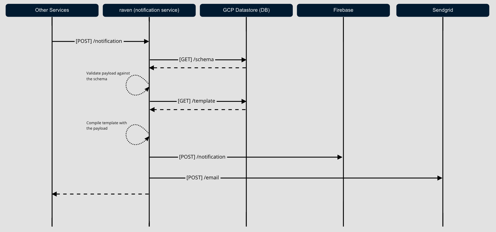

# Validating JSON with TypeScript Interfaces

A walk-through for generating JSON schemas from TypeScript interfaces.

## Background

I previously gave a talk at the [Detroit React meetup](https://www.meetup.com/use-detroit-react-devs/events/287721469/) about how [Signal Advisors](https://www.signaladvisors.com/careers-engineering-product) uses React to create a library of email templates. One of the questions after the talk was about how we populate data into those templates. This repository demonstrates the technique we use to confidently send thousands of emails to customers with confidence.

### Template Syntax

Our templates use [handlebar.js](https://github.com/handlebars-lang/handlebars.js/), a tool for using `{{mustache}}` syntax to interpolate data.

```ts
const template = Handlebars.compile(`
  <p>Hi, my name is {{name}} and I'm from {{hometown}}.</p>
`);

const data = { name: 'Ryan Burr', hometown: 'Rochester, Michigan' };

const result = template(data);

console.log(result);
// <p>Hi, my name is Ryan Burr and I'm from Rochester, Michigan.</p>
```

Great, now we have a means of injecting data into our email templates, but what about the developer experience? How can we be sure that the data payload contains the required properties used within out template?

This was a major concern for Signal. We needed to ensure that we were sending high-quality emails to our customers with every notification we create.

## Defining our Schema with TypeScript

TypeScript was a perfect fit for describing the shape of the data needed for our notification templates. We can define properties as primitives or compose interfaces to describe more complex data types.

```ts
interface TemplatePayload {
  name: string;
  hometown: string;
  employer?: string;
}

const data: TemplatePayload = { 
  name: 'Ryan Burr', 
  hometown: 'Rochester, Michigan',
  employer: 'Signal Advisors'
};
```

```ts
interface Employer {
  name: string,
  location: string
}

interface Person {
  name: string;
  hometown: string;
  employer?: Employer
}

interface TemplatePayload {
  person: Person;
}

const template = Handlebars.compile(`
  <p>Hi, my name is {{person.name}} and I'm from {{person.hometown}}.</p>
  {{#if person.employer }}
    <p>I work for {{person.employer.name}} who is headquartered in {{person.employer.location}}.</p>
  {{/if}}
`);

const data: TemplatePayload = { 
  person: {
    name: 'Ryan Burr', 
    hometown: 'Rochester, Michigan',
  },
  employer: {
    name: 'Signal Advisors',
    location: 'Detroit'
  }
};

const result = template(data);

console.log(result);
// <p>Hi, my name is Ryan Burr and I'm from Rochester, Michigan.</p>
// <p>I work for Signal Advisors who is headquartered in Detroit, Michigan.</p>
```

Using TypeScript interfaces works great in this context, but what if we were receiving data from a REST endpoint where the caller doesn't have access to the type definitions? 



We need a way to share the schema we defined so it can be used at runtime.

## TypeScript Interface to JSON Schema

[JSON Schema](https://json-schema.org/) is a specification that allows you to annotate and validate JSON data.

```json
{
  "type": "object",
  "properties": {
    "person": {
      "type": "object",
      "properties": {
        "name": {
          "type": "string"
        },
        "hometown": {
          "type": "string"
        },
        "employer": {
          "type": "object",
          "properties": {
            "name": {
              "type": "string"
            },
            "location": {
              "type": "string"
            }
          },
          "required": [
            "name",
            "location"
          ]
        }
      },
      "required": [
        "name",
        "hometown"
      ]
    }
  },
  "required": {
    "person"
  }
}
```

This JSON schema represents the `TemplatePayload` mentioned earlier. The more complex your data model gets, the more unwieldy this schema will get. It quickly becomes too cumbersome to manage by hand.

That is where a tool such as [typescript-json-schema](https://github.com/YousefED/typescript-json-schema) comes in. With this, we are able to generate this JSON schema right from our interface with required properties, extends, annotation keywords, and property initializers as defaults translated into our schema.

```ts
const program = TJS.getProgramFromFiles(['src/schemas/example.schema.ts']);
const schema = TJS.generateSchema(program);

console.log(schema);
/**
 {
  "$schema": "http://json-schema.org/draft-07/schema#",
  "definitions": {
    "Example1Payload": {
      "type": "object",
      "properties": {
        "name": {
          "type": "string"
        },
        "hometown": {
          "type": "string"
        }
      },
      "additionalProperties": false,
      "required": [
        "hometown",
        "name"
      ]
    }
  }
}
 * /
```